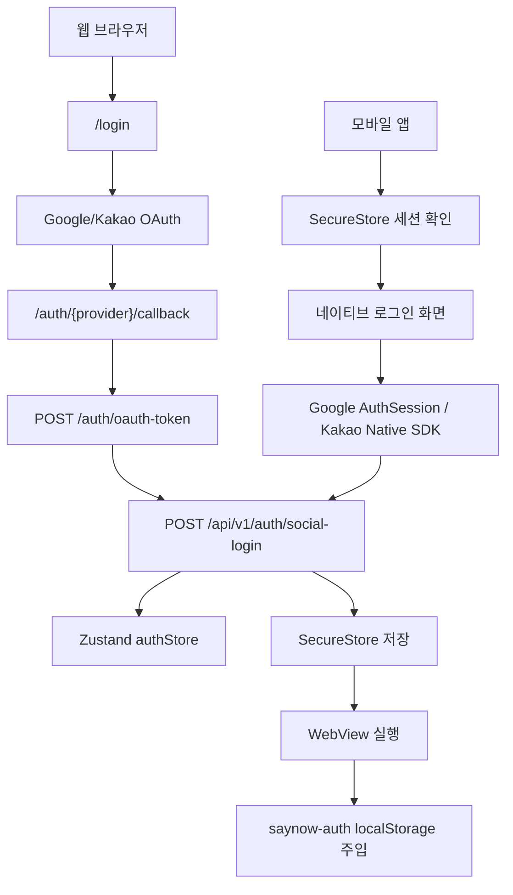

# SayNow Auth Flow

현재 인증 구조는 환경별로 명확히 분리한다.

- 웹 브라우저: Next.js 웹 앱이 직접 OAuth를 진행한다.
- 모바일 앱: Expo 네이티브 로그인 화면에서 로그인한 뒤 WebView를 연다.
- 앱 안 WebView: 자체 로그인 화면을 쓰지 않고, 앱이 주입한 SayNow 세션으로 동작한다.

이 문서는 현재 코드 기준이다.

## 핵심 원칙

1. 백엔드 인증의 최종 진입점은 항상 `POST /api/v1/auth/social-login`이다.
2. provider OAuth 토큰은 프론트가 획득하고, 백엔드는 provider `idToken`을 검증한 뒤 SayNow 토큰을 발급한다.
3. 모바일 앱의 영구 인증 저장소는 `SecureStore`다.
4. WebView `localStorage`는 웹 앱을 로그인 상태로 실행하기 위한 동기화 복사본이다.
5. refresh token이 회전되면 WebView와 앱 저장소가 같이 갱신되어야 한다.

## 전체 구조



## 웹 브라우저 로그인

웹 브라우저에서 `/login`에 직접 접근했을 때의 흐름이다.

### 공통 흐름

1. 사용자가 Google 또는 Kakao 버튼을 누른다.
2. `apps/web/src/lib/webSocialLogin.ts`가 `nonce`, `state`, redirect URI를 만든다.
3. `sessionStorage`에 pending login 정보를 저장한다.
4. provider authorization URL로 이동한다.
5. provider가 `/auth/{provider}/callback`으로 authorization code를 돌려준다.
6. callback 페이지가 `state`와 pending 정보를 검증한다.
7. `POST /auth/oauth-token`으로 authorization code를 idToken으로 교환한다.
8. `POST /api/v1/auth/social-login`에 `{ provider, idToken, nonce }`를 보낸다.
9. 응답의 SayNow 토큰과 member를 Zustand authStore에 저장한다.
10. `/`로 이동한다.

### Google 웹

- OAuth URL: `https://accounts.google.com/o/oauth2/v2/auth`
- scope: `openid email profile`
- PKCE 사용
- 저장값: `nonce`, `state`, `codeVerifier`
- token exchange: Next.js route handler가 Google Token API 호출

### Kakao 웹

- OAuth URL: `https://kauth.kakao.com/oauth/authorize`
- scope: `openid,profile_nickname`
- PKCE 미사용
- 저장값: `nonce`, `state`
- token exchange: Next.js route handler가 Kakao Token API 호출
- `KAKAO_CLIENT_SECRET`은 서버 전용 환경변수로만 사용한다.

## 모바일 앱 로그인

앱에서는 WebView 로그인 페이지를 먼저 띄우지 않는다. 앱이 네이티브 로그인 화면을 보여주고, 로그인 성공 후 WebView를 연다.

### 앱 시작

1. `SecureStore`에서 `saynow-native-auth`를 읽는다.
2. 저장된 `refreshToken`이 없으면 네이티브 로그인 화면을 보여준다.
3. 저장된 `refreshToken`이 있으면 `POST /api/v1/auth/token/refresh`를 호출한다.
4. 성공하면 새 SayNow 토큰을 `SecureStore`에 저장하고 WebView를 연다.
5. 실패하면 `SecureStore`를 삭제하고 네이티브 로그인 화면을 보여준다.

### 앱 로그인 공통

1. 네이티브 로그인 화면에서 provider 버튼을 누른다.
2. 앱이 `nonce`를 생성한다.
3. provider idToken을 획득한다.
4. 앱이 직접 `POST /api/v1/auth/social-login`을 호출한다.
5. SayNow `accessToken`, `refreshToken`, `member`를 `SecureStore`에 저장한다.
6. WebView를 시작한다.
7. WebView 로딩 전에 `localStorage.saynow-auth`를 주입한다.

### Google 앱

현재는 Expo AuthSession을 사용한다.

```text
Expo AuthSession
  -> Google authorization code 획득
  -> Google Token API로 code 교환
  -> idToken 획득
  -> /api/v1/auth/social-login
```

사용 client ID:

- Android: `EXPO_PUBLIC_GOOGLE_ANDROID_CLIENT_ID`
- iOS: `EXPO_PUBLIC_GOOGLE_IOS_CLIENT_ID`
- fallback: `EXPO_PUBLIC_GOOGLE_WEB_CLIENT_ID` 또는 `EXPO_PUBLIC_GOOGLE_CLIENT_ID`

장기적으로 완전 네이티브 SDK 구조를 원하면 `@react-native-google-signin/google-signin` 전환을 검토한다.

### Kakao 앱

Kakao Native SDK를 사용한다.

```text
@react-native-kakao/user login()
  -> 카카오톡 또는 카카오계정 로그인
  -> Kakao SDK가 token exchange 처리
  -> idToken 획득
  -> /api/v1/auth/social-login
```

요청 scope:

```text
profile_nickname
```

주의:

- Kakao OpenID Connect가 켜져 있어야 idToken이 발급된다.
- 이메일은 Kakao Developers 동의항목에서 허용되어야 내려온다.
- 현재 `@react-native-kakao/user` 래퍼가 native nonce 전달을 지원하지 않아 로컬 패치를 적용했다.
- 패치 파일: `apps/mobile/scripts/patch-kakao-user-nonce.js`
- `npm install` 후 `postinstall`에서 해당 패치가 다시 적용된다.
- 운영 장기화 전에는 라이브러리 fork, PR, 또는 자체 native module로 정식화하는 것이 좋다.

## 토큰 저장 위치

| 환경 | accessToken | refreshToken | source of truth |
| --- | --- | --- | --- |
| 웹 브라우저 | Zustand 메모리 | `localStorage`의 `saynow-auth` | 웹 authStore |
| 모바일 앱 | React Native state 및 `SecureStore` 세션 | `SecureStore` | 앱 SecureStore |
| 앱 안 WebView | 앱이 주입한 `localStorage.saynow-auth` | 앱이 주입한 `localStorage.saynow-auth` | 앱 SecureStore |

웹 브라우저의 authStore는 `partialize`로 `refreshToken`과 `member`만 영구 저장한다. 앱 WebView에서는 앱이 WebView를 즉시 로그인 상태로 만들기 위해 `accessToken`, `refreshToken`, `member`를 주입한다.

## WebView 세션 주입

앱 로그인 또는 앱 시작 refresh가 성공하면 WebView에 아래 형태의 값을 주입한다.

```json
{
  "state": {
    "accessToken": "saynow-access-token",
    "refreshToken": "saynow-refresh-token",
    "member": {
      "memberId": "1",
      "nickname": "Ryan",
      "email": "ryan@example.com",
      "provider": "KAKAO",
      "newMember": false
    }
  },
  "version": 0
}
```

저장 key:

```text
saynow-auth
```

주입 후 WebView가 `/login`에 있으면 `/`로 이동시킨다.

## 토큰 갱신

### 웹 브라우저

1. API 요청에 `Authorization: Bearer {accessToken}`을 붙인다.
2. 401이 오면 `refreshToken`으로 `POST /api/v1/auth/token/refresh`를 호출한다.
3. 성공하면 새 토큰을 authStore에 저장하고 원래 요청을 재시도한다.
4. 실패하면 authStore를 지우고 `/login`으로 이동한다.

### 앱 안 WebView

WebView 내부 웹 앱도 동일하게 refresh를 수행한다. refresh token은 회전되므로 새 토큰을 앱에도 알려야 한다.

현재 구현:

```text
WebView 401
  -> /api/v1/auth/token/refresh
  -> authStore 갱신
  -> AUTH_SESSION_UPDATED bridge message
  -> 앱 SecureStore 갱신
```

관련 파일:

- `apps/web/src/lib/api/client.ts`
- `apps/web/src/bridge/commands.ts`
- `apps/mobile/App.tsx`

## 로그아웃

현재 API 함수는 준비되어 있지만, 앱과 WebView 사이의 완전한 로그아웃 동기화는 정리 필요하다.

목표 흐름:

```text
웹에서 로그아웃
  -> POST /api/v1/auth/logout
  -> authStore clear
  -> WebView localStorage clear
  -> AUTH_SESSION_CLEARED bridge message
  -> 앱 SecureStore clear
  -> 앱 네이티브 로그인 화면으로 복귀
```

필요 작업:

- `AUTH_SESSION_CLEARED` bridge message 추가
- 앱에서 `clearAuthSession()` 호출 후 `authStatus = signedOut`
- 웹 로그아웃 UI 또는 command에서 bridge 호출

## 환경변수

### `apps/web/.env.local`

| 변수 | 용도 |
| --- | --- |
| `NEXT_PUBLIC_API_BASE_URL` | Next.js `/api/*` rewrite 대상 백엔드 주소 |
| `NEXT_ALLOWED_DEV_ORIGINS` | Next.js 개발 서버 허용 origin |
| `NEXT_PUBLIC_ENABLE_DEV_LOGIN` | 로컬 개발용 임시 로그인 버튼 |
| `NEXT_PUBLIC_DEV_ACCESS_TOKEN` | 로컬 개발용 access token |
| `NEXT_PUBLIC_DEV_REFRESH_TOKEN` | 로컬 개발용 refresh token |
| `NEXT_PUBLIC_GOOGLE_WEB_CLIENT_ID` | Google 웹 OAuth client ID |
| `NEXT_PUBLIC_GOOGLE_CLIENT_ID` | Google client ID fallback |
| `GOOGLE_CLIENT_SECRET` | Google token exchange client secret, 선택 |
| `NEXT_PUBLIC_GOOGLE_REDIRECT_URI` | Google 웹 callback URI |
| `NEXT_PUBLIC_KAKAO_REST_API_KEY` | Kakao REST API key |
| `KAKAO_CLIENT_SECRET` | Kakao token exchange client secret |
| `NEXT_PUBLIC_KAKAO_REDIRECT_URI` | Kakao 웹 callback URI |

### `apps/mobile/.env`

| 변수 | 용도 |
| --- | --- |
| `EXPO_PUBLIC_WEB_URL` | WebView가 로드할 Next.js 주소 |
| `EXPO_PUBLIC_API_BASE_URL` | 앱이 직접 호출할 API base URL. 없으면 `EXPO_PUBLIC_WEB_URL` 사용 |
| `EXPO_PUBLIC_AUTH_REDIRECT_URI` | Google AuthSession redirect URI |
| `EXPO_PUBLIC_GOOGLE_ANDROID_CLIENT_ID` | Android Google OAuth client ID |
| `EXPO_PUBLIC_GOOGLE_IOS_CLIENT_ID` | iOS Google OAuth client ID |
| `EXPO_PUBLIC_GOOGLE_WEB_CLIENT_ID` | Google client ID fallback |
| `EXPO_PUBLIC_GOOGLE_CLIENT_ID` | Google client ID fallback |
| `EXPO_PUBLIC_KAKAO_REST_API_KEY` | Kakao REST API key |
| `EXPO_PUBLIC_KAKAO_NATIVE_APP_KEY` | Kakao Native App Key |

## Provider 콘솔 설정

### Google

- Android package name: `com.saynow.app`
- Android OAuth client ID 필요
- Web OAuth client ID 필요
- 웹 callback URI 등록:
  - `http://localhost:3000/auth/google/callback`
- 실제 배포 도메인이 생기면 production callback URI도 추가한다.

### Kakao

- Android package name: `com.saynow.app`
- Android key hash 등록 필요
- Native App Key 사용
- REST API key 사용
- Kakao Login ON
- OpenID Connect ON
- 동의항목:
  - 닉네임: `profile_nickname`
- 웹 callback URI 등록:
  - `http://localhost:3000/auth/kakao/callback`

## 유지보수 체크리스트

- Kakao nonce 로컬 패치를 정식화한다.
- 로그아웃 bridge 동기화를 완성한다.
- 웹과 앱의 scope 목록을 한 곳에서 문서화하고 변경 시 같이 검토한다.
- refresh token 회전 후 SecureStore 갱신이 깨지지 않는지 회귀 테스트한다.
- production 도메인과 OAuth redirect URI를 분리 관리한다.
- 앱 배포 build hash와 Kakao Android key hash가 바뀌는지 확인한다.
