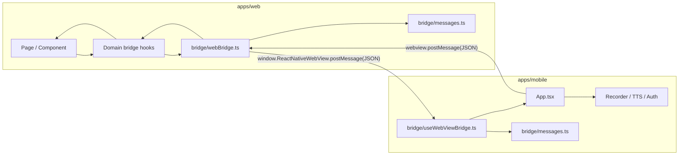
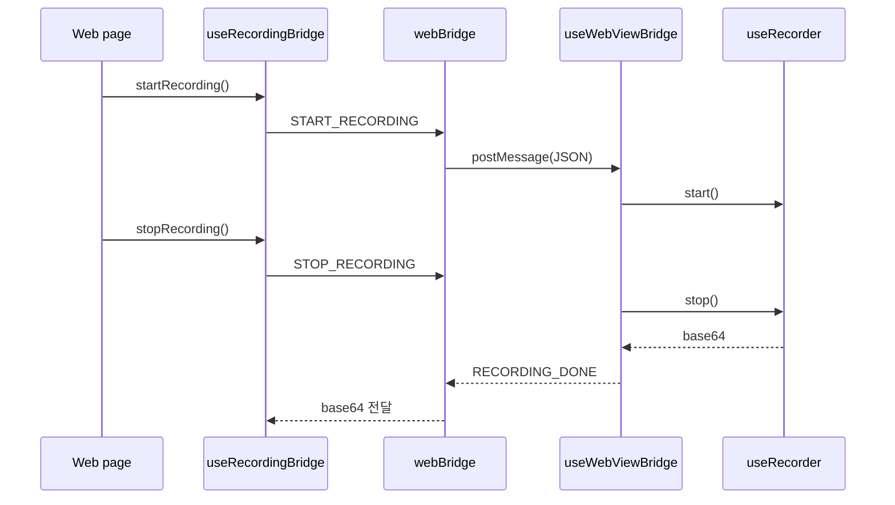
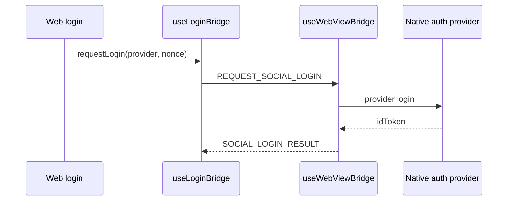

# WebView Native Bridge

웹과 React Native 앱은 WebView의 `postMessage`를 통해 JSON 메시지를 주고받는다. 브릿지의 목표는 화면 컴포넌트가 `window.ReactNativeWebView`, `WebViewMessageEvent`, JSON 파싱 규칙을 직접 알지 않아도 되게 만드는 것이다.

## 구조



## 파일 역할

| 위치 | 역할 |
| --- | --- |
| `apps/web/src/bridge/messages.ts` | 웹이 받는 네이티브 메시지 타입, 웹이 보내는 메시지 타입, 직렬화와 파싱 |
| `apps/web/src/bridge/webBridge.ts` | `postMessage` 송신과 `message` 이벤트 구독을 중앙화 |
| `apps/web/src/bridge/commands.ts` | `startNativeRecording`, `playNativeTts`처럼 웹에서 호출하는 명령 함수 |
| `apps/web/src/bridge/useBridgeEvent.ts` | 타입별 네이티브 이벤트 구독 훅 |
| `apps/web/src/hooks/useRecordingBridge.ts` | 녹음 도메인의 네이티브 브릿지와 브라우저 fallback 처리 |
| `apps/web/src/hooks/useTts.ts` | 네이티브 TTS 요청과 브라우저 SpeechSynthesis fallback 처리 |
| `apps/web/src/hooks/useLoginBridge.ts` | 소셜 로그인 요청과 결과 수신 |
| `apps/web/src/hooks/useBackButtonBridge.ts` | 네이티브 뒤로가기 이벤트 처리 |
| `apps/mobile/bridge/messages.ts` | 모바일이 받는 웹 메시지 타입, 모바일이 보내는 메시지 타입, 직렬화와 파싱 |
| `apps/mobile/bridge/useWebViewBridge.ts` | WebView 메시지 파싱, 핸들러 디스패치, Android hardware back 전달 |
| `apps/mobile/App.tsx` | 실제 녹음, 권한, TTS, 로그인 명령 핸들러 연결 |

## 메시지 타입

### Web to Native

```ts
type WebToNativeMessage =
  | { type: 'START_RECORDING' }
  | { type: 'STOP_RECORDING' }
  | { type: 'REQUEST_MIC_PERMISSION' }
  | { type: 'OPEN_SETTINGS' }
  | { type: 'PLAY_TTS'; text: string; url: string | null }
  | { type: 'REQUEST_SOCIAL_LOGIN'; provider: 'GOOGLE' | 'KAKAO'; nonce: string };
```

### Native to Web

```ts
type NativeToWebMessage =
  | { type: 'RECORDING_DONE'; base64: string; mimeType?: string }
  | { type: 'MIC_PERMISSION_DENIED' }
  | { type: 'MIC_PERMISSION_STATUS'; granted: boolean }
  | { type: 'SOCIAL_LOGIN_RESULT'; provider: 'GOOGLE' | 'KAKAO'; idToken: string }
  | { type: 'BACK_PRESSED' };
```

## 주요 흐름

### 녹음



### 소셜 로그인



## 확장 규칙

1. 새 명령은 양쪽 `messages.ts`의 union type에 먼저 추가한다.
2. payload 검증은 parser 안에서 처리한다. 컴포넌트나 `App.tsx`에서 임의로 `JSON.parse`하지 않는다.
3. 웹 화면은 `commands.ts`나 도메인 훅만 사용한다. `window.ReactNativeWebView.postMessage`를 직접 호출하지 않는다.
4. 모바일은 `App.tsx`에서 긴 `if/else`를 만들지 않고 `WebCommandHandlers`에 명령별 handler를 등록한다.
5. 브라우저에서도 동작해야 하는 기능은 도메인 훅 안에 fallback을 둔다.
6. 기존 raw string 메시지는 호환이 필요한 경우에만 parser에서 제한적으로 지원한다.

